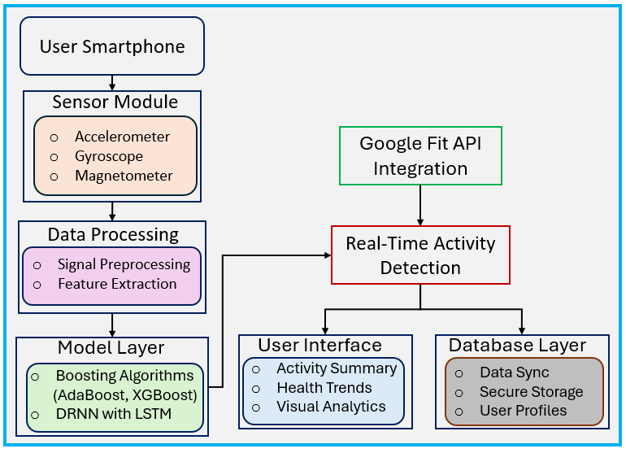

## ActiMate: A Mobile-Based Human Activity Recognition System

Real-time Human Activity Recognition using only smartphone sensors – powered by ML and deployed on Android.


---

## Overview

**ActiMate** is a smartphone-based Human Activity Recognition (HAR) system built for smart wellness and urban living. It leverages tri-axial mobile sensors—**accelerometer**, **gyroscope**, and **magnetometer**—to classify:

- Walking  
- Running  
- Standing  
- Walking Upstairs  
- Walking Downstairs

Unlike wearable-dependent solutions, ActiMate performs **real-time, on-device inference** using only a standard Android phone.

---

## Key Features

- **Bidirectional LSTM + ML Models** (XGBoost, Random Forest, AdaBoost)
- **Real-time Inference** via ONNX Runtime (No server/cloud needed)
- **Google Fit API Integration** (steps, distance, calories)
- **Personalized Calorie Estimation** (based on weight, height, age)
- **Battery Optimization Modes** for energy efficiency
- **Activity Logs + Duration Graphs**
- **Responsive and minimal UI**

---

## System Architecture

  
*Fig: End-to-end HAR pipeline from sensing to prediction and visualization.*

---

## Model Performance

| Model              | Accuracy | Precision | Recall | F1-Score |
|-------------------|----------|-----------|--------|----------|
| XGBoost           | 93.95%   | Highest   | Highest| Highest  |
| Random Forest     | 93.20%   | High      | High   | High     |
| LSTM (BiLSTM)     | 90.42%   | High      | High   | High     |
| AdaBoost          | 79.81%   | Moderate  | Moderate | Moderate |

*XGBoost achieved the best performance, while Bi-LSTM offered strong sequential modeling capability.*

---

## Dataset

- **Source**: [Mendeley Data - Pires & Garcia (2020)](https://doi.org/10.17632/xknhpz5t96.1)  
- **Subjects**: 25 volunteers  
- **Sensors**: Accelerometer, Gyroscope, Magnetometer  
- **Sampling**: 100Hz (Accel/Gyro), 50Hz (Magnetometer)  
- **Activities**: Walking, Running, Standing, Upstairs, Downstairs  

---

## Models Used

- **Bidirectional LSTM** — raw sensor sequence (50×9)  
- **Random Forest** — feature vector input  
- **AdaBoost** — ensemble method  
- **XGBoost** — best overall accuracy (93.95%)

All models were trained offline and exported to **ONNX** format for Android integration.

---

## Installation & Usage

### Clone the project:
```bash
git clone https://github.com/Nimra-1234/actimate.git
```

### Android Setup:

* Open the project in **Android Studio**
* Connect your Android device (with sensors)
* Build & Run

### ML Models:

* Place trained `.onnx` and `.h5` models inside the `/models` folder in your Android project.

---

## Tech Stack

* **Android (Kotlin)**
* **ONNX Runtime**
* **TensorFlow / scikit-learn**
* **Google Fit API**
* **Python 3.10+**

---

## Contributors

* **Nimra Tahir**
* **Mulat Tiruye**
* **Olani Gerba**
* **Nedal Elezaby**
  *University of Pisa – 2025*

---

## License

This project is licensed under the **MIT License**.
See the [LICENSE](LICENSE) file for details.

---

## References

* I. Pires and N. M. Garcia, *"Raw dataset with accelerometer, gyroscope and magnetometer data for activities with motion,"* Mendeley Data, V1, 2020. [doi:10.17632/xknhpz5t96.1](https://doi.org/10.17632/xknhpz5t96.1)

* Google Developers, *"Google Fit for Developers,"* [https://developers.google.com/fit](https://developers.google.com/fit)

---

##  Acknowledgment

Special thanks to the **University of Pisa** and the **Mobile and Social Sensing Systems** course for their support and guidance.

### Supervisors

- **Prof. Marco Avvenuti** – University of Pisa  
- **Prof. Alessio Vecchio** – University of Pisa

